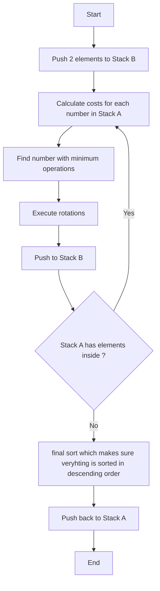

# Push Swap
A project that implements an efficient sorting algorithm using two stacks and a limited set of operations.

## Overview
Push Swap is a sorting algorithm project that challenges you to sort a stack of integers using two stacks (A and B) and a specific set of operations. The goal is to sort all numbers in stack A in ascending order while minimizing the number of operations used.

## Algorithm: Osman Sort
The project implements the Osman sort algorithm, an efficient approach that achieves excellent performance with less than 700 operations for sorting 100 random numbers. Key features include:

- **Operation-Optimal Pushing**: The algorithm intelligently pushes values from stack A to stack B by calculating and selecting moves that require the minimum number of operations
- **Complete B-Stack Utilization**: Unlike traditional approaches, Osman sort transfers all elements to stack B before beginning the sorting process
- **Turk Sort Inspiration**: While sharing some concepts with Turk sort, Osman sort implements distinct optimizations and decision-making processes
- **Performance**: Consistently achieves sub-700 operation counts for 100-number sets, making it highly competitive for the Push Swap project requirements

## Detailed Implementation Steps

### Initialization Phase
1. Push the first two elements from stack A to stack B to establish initial smallest and largest numbers
2. These elements serve as reference points for subsequent comparisons

## Flow Chart


### Main Sorting Process
1. **Cost Calculation**:
   - For each number in stack A, calculate the total operations needed to place it in the correct position in stack B
   - Compare each number with stack B's smallest and largest values
   
2. **Optimal Move Selection**:
   - Choose the number requiring the minimum total operations
   - Calculate required rotations for both stacks
   - Execute simultaneous rotations when possible to optimize operation count

3. **Three-Element Optimization**:
   - Stop pushing to stack B when three elements remain in stack A
   - Perform quick sort on these remaining elements

4. **Final Organization**:
   - Push elements back to stack A in correct order
   - Perform final rotations to position smallest number at top

## Visualizer
The project includes a visualizer tool to help understand the sorting process:
- Real-time visualization of stack operations
- Color-coded elements to track movements
- Step-by-step execution view
- Operation count display

To use the visualizer:
```bash
# Run with visualizer
./push_swap_visualizer
```

## How it Works
The program takes a list of integers as input in stack A, with stack B initially empty. Using a combination of push, swap, and rotate operations, the program must sort all numbers in ascending order in stack A, with stack B empty at the end.

### Available Operations
| Operation | Description |
|-----------|-------------|
| `sa` | Swap first 2 elements at the top of stack A |
| `sb` | Swap first 2 elements at the top of stack B |
| `ss` | Execute `sa` and `sb` simultaneously |
| `pa` | Push top element from stack B to stack A |
| `pb` | Push top element from stack A to stack B |
| `ra` | Rotate stack A up (first element becomes last) |
| `rb` | Rotate stack B up (first element becomes last) |
| `rr` | Execute `ra` and `rb` simultaneously |
| `rra` | Reverse rotate stack A (last element becomes first) |
| `rrb` | Reverse rotate stack B (last element becomes first) |
| `rrr` | Execute `rra` and `rrb` simultaneously |

## Checker Program
The checker program is a crucial component for validation:

### Features
- Reads operations from standard input
- Validates operation syntax
- Executes operations on the stacks
- Verifies final sorted state

### Error Handling
- Empty strings
- Non-numeric parameters
- Duplicates
- Invalid instructions
- Memory management

### Usage
```bash
# Run checker independently
./checker 4 67 3 87 23

# Pipe push_swap output to checker
./push_swap 4 67 3 87 23 | ./checker 4 67 3 87 23
```

### Output
- `OK`: Stack is properly sorted
- `KO`: Stack is not sorted
- `Error`: Invalid input or operations

## Installation & Usage
```bash
# Compile both programs
make

# Run push_swap
./push_swap 4 67 3 87 23

# Validate with checker
./push_swap 4 67 3 87 23 | ./checker 4 67 3 87 23
```

## Project Requirements
- Conforms to 42 Norm
- Uses only allowed libc functions: write, read, malloc, free, exit
- No memory leaks
- Comprehensive error handling
- No unexpected terminations

## Algorithm Considerations
- Osman sort actively calculates operation costs for each potential move
- Different approaches may be needed for different input sizes
- Optimization is crucial for performance benchmarks
- Numbers can be normalized/indexed to simplify the sorting process

## License
This project is licensed under the MIT License - see the LICENSE file for details.
